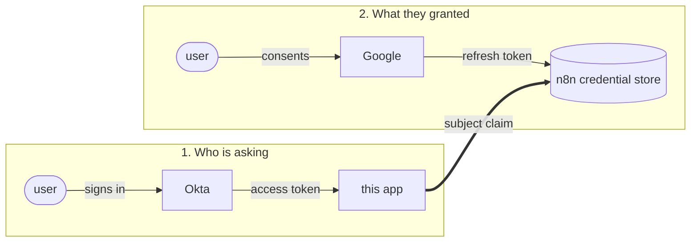

# n8n end-user credentials: a worked example

A small Express app that shows how a third-party product calls an n8n workflow **as the
person using it**, so the workflow reads that person's own Gmail rather than a shared
service account.

> ### Read this first
>
> **End-user credentials is a preview capability, and this example depends on interfaces
> that are not a stable public API.** Expect it to break.
>
> Specifically, all of the following can change without notice, and some already have
> during the few weeks this example was written:
>
> * the `/rest/workflows/:id/execution-status`, `/rest/credentials/:id/authorize` and
>   `/rest/credentials/:id/revoke` endpoints, their shapes and their auth requirements
> * the credential resolver configuration fields. Expected Audience did not exist before
>   n8n 2.37.0, so on older builds token audience is simply not validated
> * the `contextEstablishmentHooks` node parameter that carries the identity extractor
> * which triggers can establish an identity at all
>
> There is no compatibility guarantee here. Treat the version table below as the only
> configuration this has actually been observed to work in, pin your n8n version if you
> build on it, and re-test after every upgrade.
>
> This is a learning aid, not a foundation.

n8n calls this feature **end-user credentials** (internally, dynamic credentials). Instead
of a workflow being bound to one stored credential, each node resolves the credential
belonging to whoever triggered the run.

This repo is the missing half of the picture: the *calling application*. The n8n side is
well documented; what is harder to work out is what the app on the other end has to do.

## The idea in one diagram

There are two completely independent OAuth relationships. Keeping them apart is the whole
trick.



* Both `user` boxes are the same person. The two grants simply happen at different times,
  and neither knows about the other.
* The identity provider answers **who is calling**.
* Google answers **which mailbox has granted access**.
* n8n files the second under a key derived from the first.

That key is a single claim from the access token. Nothing else links the two. If two of
your systems resolve the same human to different claim values, you get two credential rows
for one person.

## What the app does

The app is an OAuth client of your identity provider. It signs the user in, then uses that
one access token for three separate calls to n8n:

| Purpose | Call |
|---|---|
| Is this workflow runnable for this caller? | `GET /rest/workflows/:id/execution-status` |
| Give me a consent URL for a missing credential | `POST /rest/credentials/:id/authorize?resolverId=…` |
| Run it | `POST` to the workflow's webhook |

Every one of those carries the caller's token in `Authorization: Bearer`. The first two
additionally carry a shared secret in `x-authorization`, which proves the *app* is allowed
to talk to those endpoints at all.

Pages:

| Route | What it shows |
|---|---|
| `/` | Sign in |
| `/status` | Per-credential readiness, connect and disconnect, which Google account is bound |
| `/token` | The introspection response n8n's resolver reads, and the join key drawn out |
| `/run` | Triggers the workflow, lists the returned mail, flags an identity mismatch |

## Tested against

| Component | Version |
|---|---|
| n8n | **2.36.7**, self-hosted, Enterprise licence, `N8N_ENV_FEAT_DYNAMIC_CREDENTIALS=true` |
| Node.js | 24.x for the app. `package.json` requires 22 or newer |
| Identity provider | Okta Integrator free plan, dedicated custom authorization server |
| Mail provider | Gmail, via a Google Cloud OAuth client |
| Last verified | August 2026 |

Two version-dependent behaviours worth knowing, both discovered on 2.36.7:

* **Expected Audience arrived in 2.37.0.** On 2.36.7 the resolver has no such field and
  does not verify that a token was issued for your n8n instance. A dedicated authorization
  server limits the exposure, since tokens minted by any other server fail introspection,
  but the check itself is absent. Set it as soon as you are on 2.37.0 or later.
* **Non-standard introspection claims pass through from 2.30.0 onward.** Using `uid` as the
  subject claim relies on that. On anything older you would be restricted to standard
  claims.

## Requirements

* **n8n** with end-user credentials available: `N8N_ENV_FEAT_DYNAMIC_CREDENTIALS=true` plus
  the Enterprise entitlement. If the feature is not licensed, the credential toggle in
  step B3 simply will not appear.
* **An OIDC identity provider that supports token introspection.** The instructions below
  use Okta; any conformant provider works, since n8n's resolver only speaks OIDC discovery
  and RFC 7662 introspection.
* **A Google Cloud OAuth client**, for the Gmail half.
* Node 22 or newer.

## Setup

### Part A. Identity provider

**A1. Register the app.** Create an OIDC app integration of type **Web Application**. Not
SPA, not native: it must be a confidential client, because n8n's resolver reuses the same
client credentials to introspect the tokens this app presents, and a public client has no
secret to introspect with.

| Field | Value |
|---|---|
| Grant types | Authorization Code, Refresh Token |
| Sign-in redirect URI | `http://localhost:3000/callback` |
| Sign-out redirect URI | `http://localhost:3000/signed-out` |

Assign yourself to the app. Forgetting this produces `access_denied` with *"User is not
assigned to the client application"*, which is app assignment, not the authorization
server policy.

**A2. Create a dedicated authorization server** with an audience that names your n8n
instance, for example `https://n8n.example.com`.

Use a custom authorization server, never the org one. And prefer a dedicated server over
the built-in `default`: `default` issues the audience `api://default` to every client in
the tenant, and the audience is the only thing binding a token to your n8n instance.
Point Expected Audience at a tenant-wide value and the check degenerates to "any token
from this org".

On that server:

* Add a scope, for example `n8n.invoke`. It is not load bearing today, since the resolver
  checks `active`, `aud` and the subject claim and never reads `scp`. It gives you
  something explicit to grant and revoke later.
* Add an **access policy with a rule**. A newly created authorization server has none;
  `default` ships with one, which is why `default` appears to work out of the box. Without
  a rule, sign-in succeeds and the token exchange fails, which reads like an app bug.
  Grant Authorization Code only. Leaving Client Credentials enabled lets the app's own
  client mint a user-less token that still passes every check the resolver makes.

**A3. Choose the subject claim, once.** Sign in and open `/token` to see exactly what your
provider returns.

On Okta access tokens, `sub` is the user's **login**, usually an email address. Prefer an
immutable claim such as `uid`. The subject is the permanent join key to someone's stored
mailbox token: if it can be renamed, a rename orphans their connection, and if it can be
reassigned, the next holder of that address inherits the previous owner's mailbox.

Changing this later strands every credential already stored.

### Part B. n8n

**B1. Environment.**

```bash
N8N_ENV_FEAT_DYNAMIC_CREDENTIALS=true
N8N_DYNAMIC_CREDENTIALS_ENDPOINT_AUTH_TOKEN=<openssl rand -hex 32>
```

The second is required. Without it the external endpoints return
`500 {"message":"Dynamic credentials configuration is invalid…"}`, not a 401, which is a
confusing way to learn a variable is unset.

You do not need the CORS variables. This app talks to n8n server to server, so no browser
preflight ever happens.

**B2. Create the resolver.** Settings, then Credential resolvers, then a new OAuth2
Resolver.

| Field | Value |
|---|---|
| Metadata URL | `<issuer from A2>/.well-known/openid-configuration` |
| Validation Method | OAuth2 Token Introspection |
| Client ID / Secret | from A1 |
| Expected Audience | the audience from A2 |
| Subject Claim | your choice from A3 |

Introspection rather than UserInfo, deliberately. UserInfo answers "is this token real and
whose is it" but not "was it issued for n8n", so any valid token from the same provider
resolves. Introspection returns `aud`, which is what makes the audience check possible.

Expected Audience requires **n8n 2.37.0 or newer**; see the version table above.

**B3. Create the Gmail credential in a team project.** End-user credentials are refused in
personal projects, so open a team project first and create the credential from there. The
toggle is **Set up for end-user credentials**, and it only appears for OAuth credential
types.

Turn the toggle on *before* connecting an account. Off, the connect button writes a shared
token onto the credential; on, it writes a per-user connection. Same button, different
destination. You should see the subtitle *"This connection is only usable by you"* once it
is right.

The account you connect here is used only for editor test runs, the MCP trigger, and Chat
Hub. Production runs resolve the caller's own token.

**B4. Import the workflows** from [`workflows/`](workflows), into the same team project as
the credential.

| File | Purpose |
|---|---|
| `fetch-caller-gmail.json` | Webhook, Gmail, respond. The thing being demonstrated. |
| `report-connected-account.json` | Optional. Reports which Google account a caller is bound to. |

For each one, after import:

1. Open the Gmail and HTTP Request nodes and select your credential.
2. Settings, then **Dynamic credential resolver**, then pick the resolver from B2.
   Skipping this is the classic 404 on the authorize URL.
3. Publish. Production webhook URLs do not answer until then.

The Webhook trigger carries the identity extractor, under **Identify user for end-user
credentials**, set to **Bearer Token Extractor**. It survives the import. A key icon on the
node confirms it is live. Webhook is the only trigger this extractor supports.

### Part C. The app

```bash
cp .env.example .env   # then fill it in; every variable is documented inline
npm install
npm start
```

Open <http://localhost:3000>.

First run, `/status` shows the credential as `missing`. Connect it, complete the Google
consent, and it flips to `connected`. Then `/run` returns your own mail.

## Things that are easy to get wrong

**A missing credential fails the run.** There is no silent fallback to the credential's own
account. That is the behaviour you want, and it is worth seeing: send a bogus bearer token
to the webhook and you get the error branch, not somebody's inbox.

**The provider consent flow needs a popup.** n8n's OAuth callback page ends by calling
`window.close()`, which browsers only honour for a script-opened window. A full-tab
redirect leaves the user stranded on "Connection successful" with no way back. This app
opens a popup and polls `closed`, since the popup is cross-origin once it reaches the
provider.

**Nothing checks that the Google account matches the identity.** A user can consent with
any Google account they can log into, and it will be bound to their identity-provider
subject. This is not privilege escalation, since they already had access to that mailbox,
but attribution is then wrong. This app detects it, by asking Gmail `users.getProfile` and
comparing, and warns. Enforcing it needs either an Internal publishing status on the Google
client or a check inside the workflow that fails the run.

**n8n cannot tell you which Google account is connected.** Gmail's scope set requests no
identity scope, so the stored token carries no email claim, and the execution-status
response has no field for it. Google is the only source, which is why
`report-connected-account.json` exists.

**Production execution data is redacted.** Workflows using end-user credentials force
redaction of non-manual runs, so you will not see message contents in n8n's execution list
even though the app displays them.

**Scheduled and polling triggers cannot do this.** Support today is OAuth credentials plus
triggered workflows.

## Project layout

```
src/index.js    routes and page composition
src/okta.js     OIDC: discovery, PKCE, refresh, revocation, introspection
src/n8n.js      the n8n calls, and the two auth headers they carry
src/views.js    layout, styles, client-side behaviour
workflows/      importable n8n workflows
public/logo/    service marks
```

## Not production code

This is a demo. Sessions are in memory, there is no CSRF protection on the internal forms,
tokens live in the session cookie store, and errors render stack traces. It is built to
make the credential flow legible, not to be deployed.

Logos belong to their respective owners and are included for illustration.
